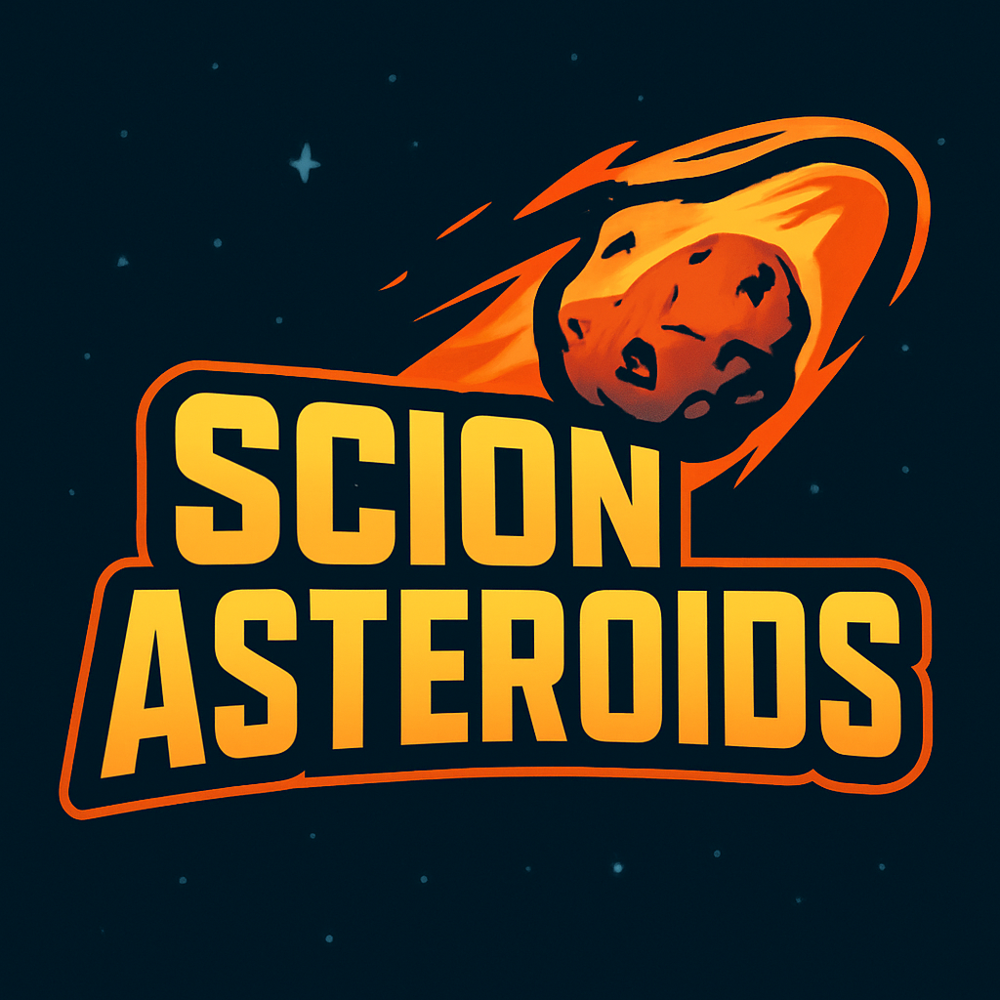

# Scion Asteroids


## Scion Asteroids Template Project
----
This is a **template project** that can be loaded into the editor. The goal of this project was to try to showcase
as many **Scion2D** features as possible.
 
Some of the features included are:
* Scion Events are used in the lua scripts to trigger different events such as ship events to the hud and more.
* ```S2D_Class``` was used for all lua classes created.
* ```State``` and ```Statestack``` were used for the game, pause, title, and game over states.
* ```Timers```, ```Soundfx```, ```Music```.
* Gamepad Rumble when the ship gets hit.
* and more.


# 🚀 Game Controls

## 🛰️ Ship Controls

| Action              | Keyboard          | Gamepad                  |
|---------------------|------------------|--------------------------|
| Forward             | **W**            | **D-Pad Up**             |
| Rotate CCW          | **A**            | **D-Pad Left**           |
| Rotate CW           | **S**            | **D-Pad Right**          |
| Fire                | **Space**        | **X Button**             |
| Speed Boost         | **Right Shift**  | **Right Trigger (RT)**   |


